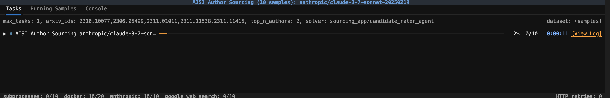

# Sourcing with LLMs

This is a sourcing application built with Python, which accepts a list of arxiv paper urls, and then uses LLM agents to get background information about the authors. The current MVP doesn't have a frontend, and uses inspect_ai to go from a list of arxiv paper urls to a parsed list of authors. Currently this supports a single LLM agent, and is more of a proof of concept for exploring the idea, rather than a fully fledged application.

## Installation

1) Install python dependencies

This project uses uv (installation instructions [here](https://docs.astral.sh/uv/getting-started/installation/)) as a package manager, we recommend installing dependencies with uv as follows:
```bash
uv venv
source .venv/bin/activate
uv sync --all-groups
```

Alternatively, you can install using pip:
```bash
python -m venv .venv
source .venv/bin/activate
pip install -e .
```

2) Create a .env file
To be able to run the application, you need to create a .env file with the relevant API keys. An example .env file is provided in .env.example.


## Repo Structure

- `docs/` - Documentation for the project
- `outputs/` - Outputs from the application
- `scripts/` - Example usage of the application
- `src/sourcing_app/` - Main application code
    - `arxiv.py` - Code using the arxiv package to get authors from arxiv paper urls
    - `agents.py` - The agents used to source authors
    - `task.py` - The definition of the Inspect Task used to source authors
    - `utils.py` - Utility functions used in the project

## Example Usage 

To run an example applicaiton, you can use the following command:
```bash
python ./scripts/run_list_of_urls.py
```
You should then see the inspect_ai UI open up in your browser:



This will run the application on the example arxiv urls in `scripts/example_arxiv_urls.txt`, and save the output in the `outputs` folder. The output consists of an inspect log, and a csv file with the relevant authors---an example output is provided in `outputs/example_output/`.

## Current state of the repository and takeaways

Here are some takeaways from my experimentation:
- Even under the current under-optimised scaffolding, the LLM agents are able to navigate the web, and often find out who the person is that they are looking for.
- Currently, they are able to find at least some information (e.g. current place of work, personal website links, etc.) with OK reliability but far from perfect.
- Many relevant sites (most notably likedin) will block the LLM by default, which is a relatively large barrier.
- Price is OK, ends up being <£0.05 per author in all cases I have seen so far.
- The LLMs seem pretty bad at actual discerning whether a candidate would be exciting using the criteria, but this may be fixable with a more sophisticated prompt.

I would guess with a more work (maybe a few days from an engineer, working with someone who understand recruiting), this could be made into a relatively good function
